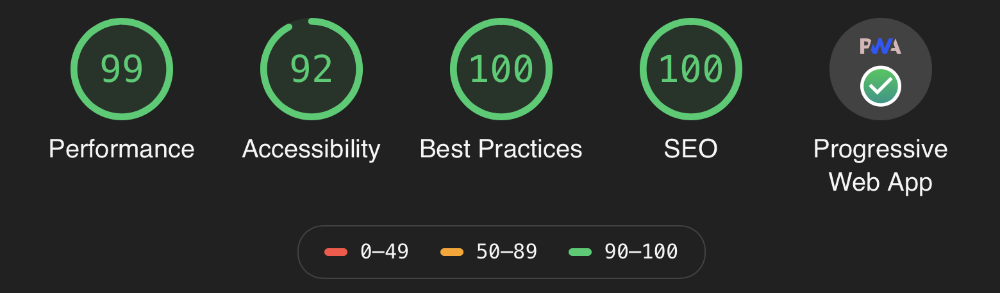

# Personal website 

My personal website, that doubles as my online portfolio.
Once on the website, others can read some basic information about me, read my blog (updated from time to time), and view my GitHub projects, as well as browse some of the photographs I have taken.

## :open_file_folder: Frameworks, languages and libraries used
* ReactJS and GatsbyJS at the front end
* SCSS for styling

## :rocket: Performance
Below shown the results from running a Lighthouse Audit&nbsp;

## :date: Future plans
In the works is currently a gallery with photographs that I have taken over the years.

Visitors to the website will  have the possibility to filter the photographs by appropriate filters. Search by keywords will be made available, like searching for "London", "January" or "city" on the photographs page will return photographs marked with those keywords, that is photographs taken in the specific location, on the specific date/time/month/year, or containing the object(s) searched for.

## :globe_with_meridians: Hosting
Last, but not least, the website is hosted using Netlify, and can be accessed [here](https://piotr-rutkowski.com).
